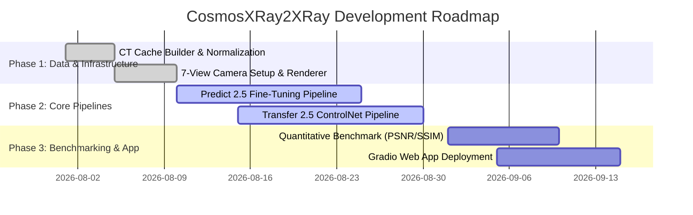

# Project Proposal & Roadmap — CosmosXRay2XRay

This document outlines the strategic proposal, core objectives, target deliverables, and milestone roadmap for **CosmosXRay2XRay**.

---

## 1. Executive Summary

**CosmosXRay2XRay** addresses the fundamental challenge of 3D anatomical perception from 2D chest radiographs. By leveraging NVIDIA's **Cosmos 2.5** video world foundation models, the project enables high-fidelity, spatio-temporally consistent 7-view X-ray synthesis (AP, PA, LAT-L, LAT-R, LAO, RAO, Cranial) from a single 2D radiograph or CT volume prompt.

---

## 2. Core Objectives

1. **Predict 2.5 Pipeline**: Fine-tune `MinimalV1LVGDiT` on continuous 7-view X-ray video latents to capture $360^\circ$ anatomical rotation.
2. **Transfer 2.5 ControlNet Pipeline**: Integrate Sobel edge map and depth map conditioning via `MinimalV4LVGControlVaceDiT` to enforce anatomical edge fidelity.
3. **Clinical Validation**: Evaluate zero-shot transfer performance on real-world clinical X-rays (`VinDr-CXR`).

---

## 3. Milestone Roadmap

